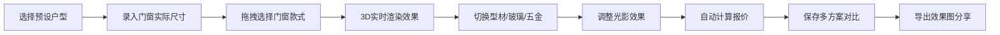

## 1. 产品概述

断桥铝门窗3D预览工具，帮助门窗门店解决客户难以直观预览门窗安装效果的痛点，通过3D实时渲染技术让客户沉浸式体验门窗安装效果，提升成交效率。

- **核心价值**：将传统样品、图纸介绍方式升级为沉浸式3D体验，直观展示门窗安装实景效果
- **目标用户**：门窗门店导购人员、终端客户
- **使用场景**：门店导购介绍、客户方案确认、效果展示与分享

## 2. 核心功能

### 2.1 用户角色
| 角色 | 使用方式 | 核心功能 |
|------|----------|----------|
| 导购人员 | 电脑/平板操作 | 录入尺寸、选择款式、配置方案、生成报价 |
| 终端客户 | 查看效果 | 预览3D效果、对比方案、保存效果图 |

### 2.2 功能模块
1. **3D场景编辑器**：实时3D渲染、户型选择、门窗拼装
2. **门窗素材库**：型材款式、玻璃样式、五金配件、配色方案
3. **配置控制面板**：尺寸录入、材质切换、光影调节
4. **方案对比系统**：多方案保存、一键切换对比
5. **报价与导出**：自动算料、实时报价、效果图导出

### 2.3 页面详情
| 页面名称 | 模块名称 | 功能描述 |
|----------|----------|----------|
| 主编辑器 | 3D视口 | 实时渲染门窗安装效果，支持旋转缩放 |
| 主编辑器 | 左侧素材面板 | 门窗类型选择、款式列表、快速拼装 |
| 主编辑器 | 右侧配置面板 | 尺寸调整、颜色切换、玻璃选择、五金配置 |
| 主编辑器 | 底部工具栏 | 方案管理、光影切换、报价显示、导出图片 |
| 方案对比 | 对比视图 | 2-4个方案并排展示，一键切换对比 |

## 3. 核心流程

## 4. 用户界面设计

### 4.1 设计风格
- **主色调**：深灰色(#1a1a2e)为底色，金色(#d4af37)为点缀，体现高端门窗品质感
- **辅助色**：科技蓝(#16213e)、暖橙色(#e94560)
- **按钮风格**：微立体圆角按钮，hover有光泽效果
- **字体**：标题使用Noto Serif SC体现高端质感，正文使用Noto Sans SC保证可读性
- **布局风格**：三栏式布局（左素材-中3D-右配置），深色工业风主题
- **图标风格**：线性图标配合轻微渐变，科技感与专业感并重

### 4.2 页面设计概述
| 页面名称 | 模块名称 | UI元素 |
|----------|----------|--------|
| 主编辑器 | 3D视口 | 深色渐变背景、环境光、动态阴影、相机控制提示 |
| 主编辑器 | 左侧面板 | 分类标签页、卡片式素材列表、拖拽指示器 |
| 主编辑器 | 右侧面板 | 折叠式配置组、颜色选择器、滑块控件、实时预览小图 |
| 主编辑器 | 底部栏 | 方案切换标签、报价浮窗、导出按钮组 |

### 4.3 响应式
- **桌面端**：完整三栏布局，3D视口占60%宽度
- **平板端**：左右面板可折叠，支持触控手势旋转缩放
- **性能优化**：低配设备自动降级渲染质量，保证流畅运行

### 4.4 3D场景指导
- **环境设置**：室内场景，配合同色系家具烘托氛围
- **光照系统**：两套预设 - 白天自然光（明亮柔和）、傍晚暖光（温馨氛围感）
- **相机设置**：默认第三人称视角，可环绕观察，限制俯仰角度避免穿模
- **交互体验**：选中门窗高亮显示，拖拽时有吸附反馈，材质切换平滑过渡
- **后期效果**：轻微泛光、环境光遮蔽，提升画面质感
- **性能预算**：单场景面数控制在5万面以内，支持低端设备流畅运行
