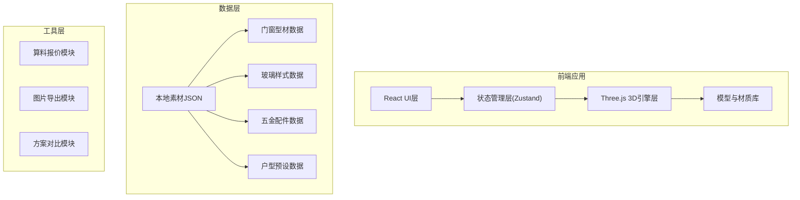

## 1. 架构设计



## 2. 技术描述

- **前端框架**：React@18 + TypeScript + Vite
- **3D引擎**：three@0.160 + @react-three/fiber@8 + @react-three/drei@9
- **状态管理**：zustand@4
- **样式方案**：tailwindcss@3
- **后期处理**：@react-three/postprocessing
- **后端**：纯前端项目，无后端依赖
- **数据存储**：本地JSON配置 + localStorage方案保存

## 3. 路由定义

| 路由 | 用途 |
|------|------|
| / | 主编辑器页面 |
| /compare | 方案对比页面 |

## 4. 数据模型

### 4.1 核心数据定义

```typescript
// 门窗类型
type WindowType = 'casement' | 'sliding' | 'folding' | 'sunroom';

// 型材配置
interface ProfileConfig {
  id: string;
  name: string;
  color: string;
  texture?: string;
  pricePerSqm: number;
}

// 玻璃配置
interface GlassConfig {
  id: string;
  name: string;
  type: 'clear' | 'frosted' | 'tinted' | 'patterned';
  opacity: number;
  color: string;
  pricePerSqm: number;
}

// 五金配置
interface HardwareConfig {
  id: string;
  name: string;
  type: 'handle' | 'hinge' | 'lock';
  pricePerSet: number;
}

// 门窗实例
interface WindowInstance {
  id: string;
  type: WindowType;
  width: number;
  height: number;
  position: [number, number, number];
  rotation: [number, number, number];
  profile: ProfileConfig;
  glass: GlassConfig;
  hardware: HardwareConfig;
}

// 户型预设
interface RoomPreset {
  id: string;
  name: string;
  type: 'bedroom' | 'balcony' | 'living';
  dimensions: { width: number; depth: number; height: number };
  wallTexture: string;
  floorTexture: string;
}

// 方案配置
interface Project {
  id: string;
  name: string;
  room: RoomPreset;
  windows: WindowInstance[];
  lighting: 'day' | 'evening';
  createdAt: number;
}

// 报价结果
interface QuoteResult {
  totalArea: number;
  profileCost: number;
  glassCost: number;
  hardwareCost: number;
  totalCost: number;
}
```

### 4.2 状态管理结构

```typescript
interface AppState {
  currentProject: Project | null;
  projects: Project[];
  selectedWindowId: string | null;
  compareProjects: string[];
  
  // 操作方法
  createProject: (roomId: string) => void;
  addWindow: (config: Partial<WindowInstance>) => void;
  updateWindow: (id: string, config: Partial<WindowInstance>) => void;
  removeWindow: (id: string) => void;
  selectWindow: (id: string | null) => void;
  setLighting: (mode: 'day' | 'evening') => void;
  saveProject: () => void;
  calculateQuote: () => QuoteResult;
  exportImage: () => string;
}
```

## 5. 目录结构

```
src/
├── components/
│   ├── editor/
│   │   ├── Scene3D.tsx          # 3D场景容器
│   │   ├── WindowModel.tsx      # 门窗模型组件
│   │   ├── RoomModel.tsx        # 房间模型组件
│   │   └── Lights.tsx           # 光照系统
│   ├── panels/
│   │   ├── MaterialPanel.tsx    # 左侧素材面板
│   │   ├── ConfigPanel.tsx      # 右侧配置面板
│   │   └── Toolbar.tsx          # 底部工具栏
│   └── common/
│       ├── ColorPicker.tsx
│       └── Slider.tsx
├── store/
│   └── useProjectStore.ts       # Zustand状态管理
├── data/
│   ├── profiles.json            # 型材数据
│   ├── glasses.json             # 玻璃数据
│   ├── hardware.json            # 五金数据
│   └── rooms.json               # 户型数据
├── utils/
│   ├── calculator.ts            # 算料报价工具
│   └── exporter.ts              # 图片导出工具
├── pages/
│   ├── Editor.tsx               # 主编辑器页面
│   └── Compare.tsx              # 方案对比页面
└── types/
    └── index.ts                 # 类型定义
```
